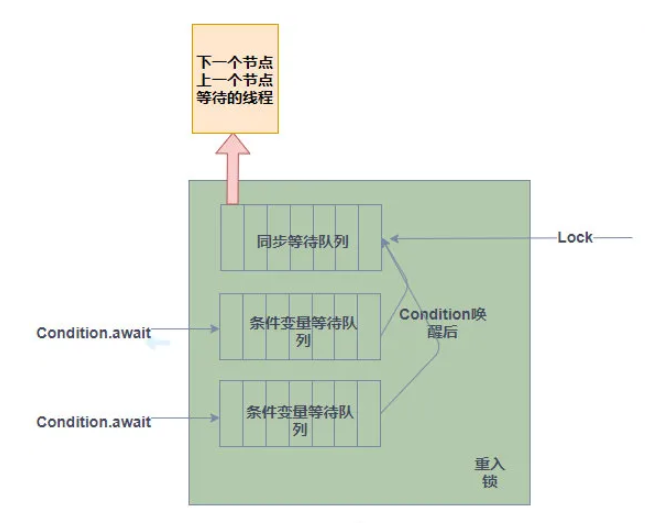

AQS 是一个用来构建锁和同步器的框架
作用
1. 管理同步状态
2. 管理同步队列
3. 阻塞和唤醒线程

> AQS 核心思想是，如果被请求的共享资源空闲，则将当前请求资源的线程设置为有效的工作线程，
> 并且将共享资源设置为锁定状态。如果被请求的共享资源被占用，那么就需要一套线程阻塞等待以及被唤醒时锁分配的机制



两种资源共享方式

1. 独占 私有   
如reentrantlock  
公平锁：根据先后顺序  
非公平锁：抢，调用lock方法时使用cas抢锁，未抢到则调用 tryAcquire ，若发现未被锁则再次调用cas抢锁，失败则按顺序等待，
公平锁在tryAcqurie则会判断是否存在线程在等待，是则等待前置线程。
非公平锁性能跟好，但是可能会出现线程长期等待的情况。

2. 共享锁
semaphore 信号量 标记资源可共享次数
countDownLatch 倒计时器 阻塞线程直至计时器为0 场景：等待多个线程加载环境或另多个线程同时在赛跑起点 一次性的
CyclicBarrier 栅栏 多次使用，基于 ReentrantLock(ReentrantLock也属于AQS同步器)和 Condition 的，类似countDownLatch


获取锁的伪代码
```
if (尝试获取锁失败) {
    把当前线程包装成节点插入同步队列
    for(true)
        if(当前节点的前一个节点是同步队列中的头节点）
            再次尝试获取锁
        if (是否应该挂起等待通知)
            挂起线程等待唤醒
}

```

释放锁的伪代码
```
释放锁
if (释放锁成功)
    while(true){
        if(当前节点不为空且不是尾节点）{//尾节点没有后续节点不需要额外操作
            if(需要唤醒后继线程）
                唤醒后继线程    
            if(已经存在其他线程修改了后继节点等待状态)
                continue;
            if(头结点未被修改)//即不存在其他线程已经唤醒线程获取了锁，如果存在则继续唤醒新的头节点的后继节点
                释放完成
        }
    }
```


###### Condition
依赖于Lock接口，生成一个Condition的基本代码是lock.newCondition()
实现线程之间的协作  
基本方法是  
await()  
    替代Object的wait()方法  
    持有锁的线程调用await()方法，释放锁，进入条件变量等待队列，等待唤醒  
    进入同步队列后等待获取锁
signal()  
    替代Object的notify()方法  
    持有锁的线程调用signal方法，将条件等待队列中的元素，移动到同步等待队列尾端，等待获取锁  

与Object的wait() notify()方法    
    