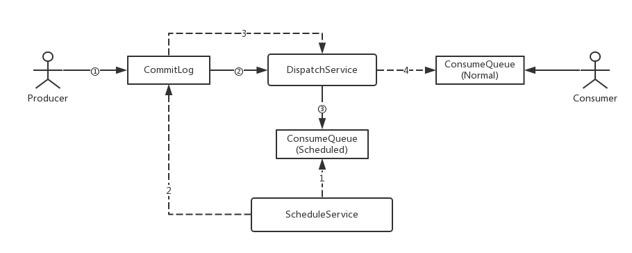
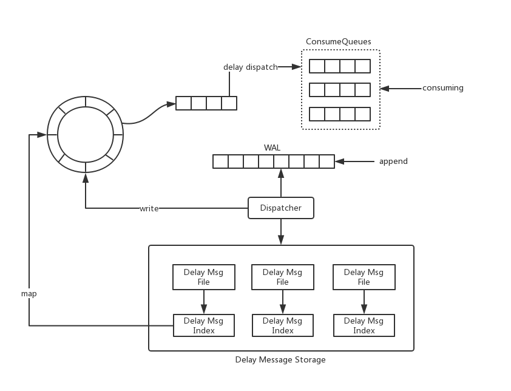

RocketMQ延时消息设计原理
流程图

具体步骤
######  消息的写入
在写入CommitLog之前，如果是延迟消息，替换掉消息的Topic和queueId(被替换为延迟消息特定的Topic，queueId则为延迟级别对应的id)
消息写入CommitLog之后，提交dispatchRequest到DispatchService
因为在第①步中Topic和QueueId被替换了，所以写入的ConsumeQueue实际上非真正消息应该所属的ConsumeQueue，而是写入到ScheduledConsumeQueue中（这个特定的Queue存放不会被消费）
ConsumeQueue中的延迟消息是有序的，同一level延迟级别下的消息，后接受到的肯定比先接收到的触发时间晚
Schedule过程中：
###### 消息的Schedule
给每个Level设置定时器，从ScheduledConsumeQueue中读取信息
如果ScheduledConsumeQueue中的元素已近到时，那么从CommitLog中读取消息内容，恢复成正常的消息内容写入CommitLog
写入CommitLog后提交dispatchRequest给DispatchService
因为在写入CommitLog前已经恢复了Topic等属性，所以此时DispatchService会将消息投递到正确的ConsumeQueue中

https://www.cnblogs.com/hzmark/p/mq-delay-msg.html
#### 任意级别延时消息
###### 阿里云RocketMQ
支持秒级延迟
最大时间范围为40天
##### 腾讯CMQ
支持秒级
最大时间范围为1小时

#### 方案设计

消息写入WAL  
Dispatcher处理延迟消息  
延迟消息一定时间的直接写入TimeWheel  
延迟超过一定时间写入DelayMessageStorage，
    链表长度为最大延迟时间/每个文件保存的时间长度。
    将WAL中的延迟消息写入到独立的文件中。这些文件按照延迟时间组成一个链表。
    那么WAL可以按照正常的策略进行过期删除，Delay Msg File则在一个文件投递完之后进行删除。
DelayMessageStorage对DelayMsgFile构建一层索引，这样在映射到TimeWheel时只需要做一次Hash操作  
通过TimeWheel将消息投递到ConsumeQueue中完成对Consumer的可见  

