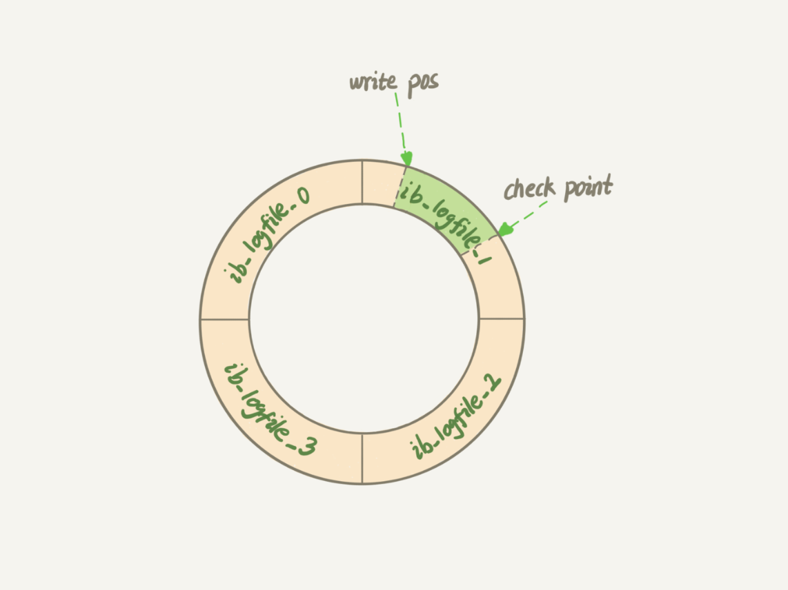

##### sql执行过程
>update table set column1 = y where column2 = X 
>1. 将记录所在的页找到并加载到内存中，进行修改(如果只修改内存未落入磁盘可能导致修改丢失，立马刷盘的性能差)
>2. 写入redo log，记录页上的修改。redo log顺序IO，速度很快。redo log buffer（MySQL进程缓冲）-> os buffer（系统缓冲） -> disk
>3. 写入bin log缓存并写入磁盘

##### WAL技术
全称是 Write-Ahead Logging ，
它的关键点就是先写日志，再写磁盘，保证持久化到磁盘。
是一种实现事务日志的标准方法。  
具体而言就是:  
1、修改记录前，一定要先写日志；  
2、事务提交过程中，一定要保证日志先落盘，才能算事务提交完成。
 
#### redolog
> 事务开始的时候，就开始记录每次的变更信息，事务开始之后就开始逐步写入磁盘
> 顺序写，在数据库运行期间不需要对redolog文件进行读取操作.
> 降低对数据页刷盘的要求，恢复时速度会比（binlog）快很多，循环写，会覆盖  
> 物理日志（数据页的变更），记录的是页的物理修改操作，记录事务执行后的状态    
> 作用：崩溃恢复，用于恢复未写入data file(磁盘)的已成功的事务更新的数据，保证持久化  
> 防止在发生故障的时间点，尚有脏页未写入磁盘，在重启mysql服务时，根据redo log进行重做，从而达到事务的持久性。  
> 保证一致性 持久性

- write pos：当前redolog写入位置
- check point：当前擦除位置

更新数据时只更新内存的change buffer，但是在事务提交的时候，我们把 change buffer 的操作也记录到 redo log 里了，
所以崩溃恢复的时候， changebuffer 也能找回来。这就是redo log在崩溃恢复中的作用。

innodb存储引擎在启动时会尝试进行恢复操作。

刷盘时机
innodb_flush_log_at_trx_commit = 0|1|2

0 – 事务提交时只将redo log写入redo log buffer,每N秒将Redo Log Buffer的记录写入Redo Log file（OS buffer），
并且将文件刷入硬件存储1次。N由innodb_flush_log_at_timeout控制。

1 – 每个事务提交时，将记录从Redo Log Buffer写入Redo Log file（OS buffer），并且将文件刷入硬件存储。

2 – 每个事务提交时，仅将记录从Redo Log Buffer写入Redo Log file（OS buffer）。Redo Log何时刷入硬件存储由操作系统和innodb_flush_log_at_timeout决定。
这个选项可以保证在MySQL宕机，而操作系统正常工作时，数据的完整性。

#### binlog
> 逻辑日志，记录数据库执行的写入性操作信息，以二进制形式保存  ，Server层日志 
> 以追加的方式写入，当文件达到最大值后，生成新的文件进行操作
> binlog有三种模式，
> row格式会记录行的内容，记两条，更新前和更新后都有，日志量比较大
> statement格式的话是记录sql语句
> mixed模式是row和statement格式混合使用  
> 作用：
> - 主从复制：在主库开启binlog，然后将binlog发送到各个从库，从库重放binlog从而达到主从一致
> - 数据恢复：通过使用mysqlbinglog工具来恢复数据

##### redolog与binlog的区别
1. redolog是innodb引擎特有，binlog是MySQL的server层实现的，所有引擎都可以使用
2. redolog是物理日志，记录的是在某个数据页上做的某些更改，而binlog是逻辑日志，记录的是执行语句的原始逻辑
3. redolog是循环写，binlog是追加写入
4. redolog在事务执行过程中不断写入，binlog在事务提交前写入

###### 问题
1. binlog代替redolog进行数据恢复？
    binlog是逻辑日志，进行数据恢复相当于重新执行一次sql，性能较差，
    数据落盘是以页为单位的，而一个sql可能涉及了多个页，一旦crash，只有部分页落盘了，那么根据sql进行重放就会出错，
    且没有刷盘标识（LSN log seq Number），无法知道哪部分数据已经刷盘成功
    todo:（使用row格式的binlog是否可以恢复到更新前的数据？？）
    而redolog 已经刷盘的数据是会擦除的，且redolog记录的是页上的修改
2. 只使用redolog不使用binlog?redolog代替binlog进行主从复制?
    redolog是循环写，历史日志无法保留，无法进行数据复制
    使用redolog进行主从复制称为物理复制，
    redolog会产生更大的日志流量，特别是索引创建、大事务处理等场景，对网络带宽有更大的需求，

#### 内部XA事务
目的：保证redo log和binlog的一致性  
步骤：  
    1. prepare：redolog写入log buffer，并fsync持久化到磁盘，在redolog事务中记录2PC的XID，在redolog事务打上prepare标识  
    2. commit：binlog写入log buffer，并fsync持久化到磁盘，在binlog事务中记录2PC的XID，同时在redolog事务打上commit标识
    
问题：
    redolog和binlog不使用两阶段提交的问题
    先写redolog后写binlog或者先写binlog后写redolog在数据库发生crash的时候都可能导致主从不一致情况发生。
          

#### Crash Safe故障恢复
1. 如果redolog的日志是完整的，即已经有commit标识，则直接提交
2. 如果redolog是prepare状态的，则判断对应事务的binlog是否存在且完整，如果是，则提交事务

> 当事务在prepare阶段crash，数据库recovery的时候该事务未写入Bin log并且存储引擎未提交，将该事务rollback。  
当事务在binlog阶段crash，此时日志还没有成功写入到磁盘中，启动时会rollback此事务。  
当事务在binlog日志已经fsync()到磁盘后crash，但是InnoDB没有来得及commit，此时MySQL数据库recovery的时候将会读出二进制日志的Xid_log_event，
然后告诉InnoDB提交这些XID的事务，InnoDB提交完这些事务后会回滚其它的事务，使存储引擎和二进制日志始终保持一致。
总结起来说就是如果一个事务在prepare阶段中落盘成功，并在MySQL Server层中的binlog也写入成功，那这个事务必定commit成功。

为什么需要保证二进制日志的写入顺序和InnoDB层事务提交顺序一致性呢？
重做的时候可能导致不一致

#### undolog
> 逻辑日志（可理解为sql语句），根据每行记录进行记录，用于记录事务开始前的状态 
> 随机读写    
> 用于事务失败时的回滚操作和MVCC
> 当用户读取一行记录，若该记录已经被其他事务占用，当前事务可以通过undo读取之前的行版本信息，以此实现非锁定读取。
> undolog会产生redolog，因为undolog也需要持久性保护。(Undo和Redo Log的这种关联，使得持久化变得复杂起来。为了降低复杂度，
>InnoDB 将 Undo Log 看作数据，因此记录Undo Log的操作也会记录到redo log中。这样undo log就可以象数据一样缓存起来， 而不用在redo log之前写入磁盘了)
> 保证原子性 一致性

回滚操作本质上也是对数据进行修改，因此回滚时对数据的操作也会记录到Redo Log中。
一个被回滚了的事务在恢复时的操作就是先redo再undo，因此不会破坏数据的一致性。

redo和undo都可以视为一种恢复操作，redo恢复提交事务修改的页操作，undo回滚行记录到某个特定版
事务执行完成的标志是写完redolog和undolog。如果在写redo log的时候断电，事务则没有执行完毕，则会根据undolog回滚到事务之前

