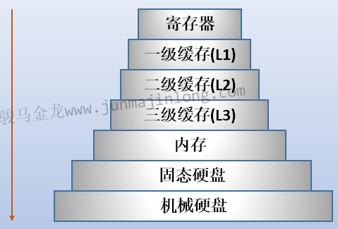

cpu高速缓存
目的：提高访问内存的效率
原因：CPU与内存的速率差距大，直接访问内存CPU将经常处于等待阶段

多级缓存
寄存器 速度最快，与CPU材料相同，距离CPU最近，容量最小
L1 容量最小，速度最快，每个核都有L1缓存，又分成数据缓存和指令缓存  
L2 容量比L1大，速度比L1慢，多数都是每个核都有L2缓存，也有共享L2  
L3 容量最大，速度最慢，多个核共享一个L3缓存  

L3之上设计L2 L1的原因
1. 速率差距
2. 减少竞争

调度切换问题
1. 切换核心后L1,L2 缓存失效，需要重新从L3中读取数据，效率下降。可以对进程绑定CPU，实现亲缘性

缓存局部性
1. 时间局部性  
某次从内存中读取的数据，可能会在不远的将来被重用
2. 空间局部性  
某次从内存中读取数据后，该数据周围的数据很可能会在不远的将来被使用

缓存一致性  
一致性：任何一个时刻，所有Core看到的数据必须是一致的  
写的顺序性：先执行的写操作，必须先被看到，后执行的写，必须后被看到

实现  
cache snooping(bus snooping)：即高速缓存监控或总线监控的方式，适合少核，不利于核数扩展
    write-invalidate：让其它所有带有该数据副本的缓存失效，所以称为”写无效协议”
    write-update：将修改的数据拷贝到所有带有该数据副本的缓存中进行覆盖，所以称为”写更新协议”
Directory-based cache conherence：基于目录实现的缓存一致性方式，适合多喝，但开销稍大

缓存写策略
1. 写命中时
    1.1 write through 直写，更新缓存的数据，同时更新内存的数据，同步模式
    1.2 write back 回写，数据写入共享缓冲(L3)后便认为本次写成功，同时在缓存项设置一个drity标志位，内存的数据只会在某个时刻更新
    
2. 未命中时
    2.1 write allocate 共享缓存中腾出一个空间(即一个缓存行)供数据写入，直接写入内存，不写入缓存
    2.2 no write allocate 绕写，直接写入内存，不写入缓存

缓存分配策略和更新策略  
当CPU从内存读数据时，如果该数据没有缓存中，CPU会把数据拷贝到缓存。  
当CPU往内存写数据时：
1. Wirte through 更新缓存的数据，同时更新内存的数据
2. Write back 只更新缓存的数据，同时在缓存项设置一个drity标志位，内存的数据只会在某个时刻更新
3. 如果再写的时候数据没有在缓存中
    3.1 write allacate 在写之前把数据加载到缓存，然后再实施上面的写策略
    3.2 no-write allocate 不加载缓存，直接把数据写到内存
