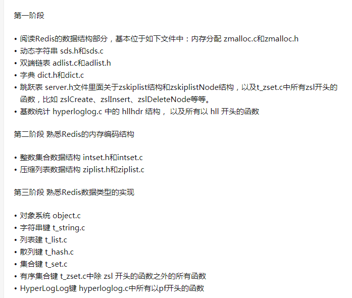

#### 源码

##### 内部数据结构
```
typedef struct redisDb {
    dict *dict;                 /* The keyspace for this DB */
    dict *expires;              /* Timeout of keys with a timeout set */
    dict *blocking_keys;        /* Keys with clients waiting for data (BLPOP)*/
    dict *ready_keys;           /* Blocked keys that received a PUSH */
    dict *watched_keys;         /* WATCHED keys for MULTI/EXEC CAS */
    int id;                     /* Database ID */
    long long avg_ttl;          /* Average TTL, just for stats */
    unsigned long expires_cursor; /* Cursor of the active expire cycle. */
    list *defrag_later;         /* List of key names to attempt to defrag one by one, gradually. */
} redisDb;
```
```
struct RedisObject{
    int4 type;        //4bit 对象类型
    int4 encoding;    //4bit 存储形式，相同的对象类型可以有不同的存储形式
    int24 lru;        //24bit lru信息
    int32 refcount;   //4byte 引用计数
    void *ptr;        //8byte 指针指向对象内容的具体存储位置
}
```
所有类型的数据结构的最终引用

###### 字符串 Simple Dynamic String


```
struct SDS{
    T capactity;       //数组容量
    T len;             //字符串长度
    byte flags;        //特殊标志位
    byte[] content;    //数组内容
}
```

短字符串为embstr，长字符串为raw。
> empstr RedisObject对象头与SDS对象头在内存中连续存储，一起分配内存。
>
> raw ReidsObject对象头与SDS对象头在内存上一般是不连续的，需要分配两次内存。
>
> 分配内存时按照2的n次幂，即2/4/8/16/32/64等的大小分配，对象头的大小为16bytes，字符串的最小大小为content.len + 1 + 1 + 1字节，即分配一个embstr的最小大小为19（16 + 3)字节。若字符串稍微大点，可以分配64字节。若超过了64字节，则认为是一个大字符串，使用raw形式存储。最大为64 - 19 - 1(NULL结束符) = 44字节 

扩容策略
    字符串长度小于1MB时，每次扩容加倍，大于1MB时，每次扩容1MB
    
###### 双向链表 list
``` C
typedef struct listNode {
     //指向前一个节点
    struct listNode *prev;
    //指向后一个节点
    struct listNode *next;
    //值
    void *value;
} listNode;

```
``` C
typedef struct list {
    //头结点
    listNode *head;
    //尾结点
    listNode *tail;
    //复制方法
    void *(*dup)(void *ptr);
    //删除
    void (*free)(void *ptr);
    //匹配
    int (*match)(void *ptr, void *key);
    unsigned long len;
} list;
```

```
typedef struct listIter {

    listNode *next;

    int direction;
} listIter;
```


###### 字典
> 类似hashmap的形式，使用数组加链表的方式

```
struct dict {
    dictType *type;
    void *privdata;
    dictht ht[2];
    long rehashidx;  /* rehashing not in progress if rehashidx == -1 是否正在rehash标记 */
    int16_t pauserehash; /* If >0 rehashing is paused (<0 indicates coding error) */
} ;

struct dictht{
    dictEntry** table; //二维数组
    long size;         //一维数组的长度
    long used;         //元素数量
    unsigned long sizemask;//size-1，进行hash
    ...
}

struct dictEntry{
    void* key;
    void* val;
    dictEntry* next;
}

```

扩容
> 正常情况下，当元素个数与二维数组大小相同是即扩容，新数组是原数组的两倍大小。
> 当元素个数小于数组长度的10%时，缩容。

渐进式rehash

步骤（有点类似于copyonwrite）
1. 初始化第二个hashtable，
2. 分步将旧hashtable中的数据迁移到新的hashtable中，每次只迁移一部分，避免集中式的rehash的庞大计算量，对redis性能产生影响可用性
迁移方式有两种
    - 对当前数据结构进行操作时辅助迁移少量数据（操作辅助rehash）
    - 定时器迁移数据（定时辅助rehash）
    - 标记迁移完成，删除旧hashtable占用的内存

>redis的数据结构中同时拥有两个hashtable
通常情况下只使用一个hashtable,，延迟初始化
只有在进行rehash 及扩容或者缩容的时候才会同时使用两个hashtable


>每次迁移在数据结构中标记当前迁移位置，以及未迁移数量（即旧hashtable中的数据量），
对redis操作时，delete,find ,update可能会在两个hashtable中进行查找，而执行add时，会判断两个hashtable中是否存在，存在则返回失败，但
>只在新的hashtable中进行添加，保证旧hashtable中的数量只减不增。


```
if(当前容量超过了扩容阈值 and 当前无子进程进行aof文件重写或生成rdb文件时)
    扩容或缩容：（初始化第二个hashtable,但不进行实际的迁移（rehash）操作）

执行增删改查操作时进行辅助迁移
    if（当前数据进行rehash)
        进行一步rehash操作
        
 周期函数定时辅助迁移
     if（当前数据进行rehash and 允许定时辅助迁移)  
         花费1ms辅助rehash操作
```
**dict.dictRehash()**
```
对dict迁移n个桶
//rehash完成返回0，未完成返回1
int dictRehash(dict *d, int n) {
    //限制最大迁移n*10个空桶，避免函数等待时间过长
    int empty_visits = n*10; /* Max number of empty buckets to visit. */
    
    //rehash完成
    if (!dictIsRehashing(d)) return 0;

    //迁移n个桶
    while(n-- && d->ht[0].used != 0) {
        dictEntry *de, *nextde;

        /* Note that rehashidx can't overflow as we are sure there are more
         * elements because ht[0].used != 0 */
        //rehash桶的下表不可能大于原数组的大小
        assert(d->ht[0].size > (unsigned long)d->rehashidx);
        //空桶
        while(d->ht[0].table[d->rehashidx] == NULL) {
            d->rehashidx++;
            if (--empty_visits == 0) return 1;
        }
        //本次需要迁移的桶，将桶内所有的元素都迁移到新的数组中
        de = d->ht[0].table[d->rehashidx];
        /* Move all the keys in this bucket from the old to the new hash HT */
        //从链表头开始进行遍历，将节点插入到新数组中对应桶的头节点
        while(de) {
            uint64_t h;
            
            nextde = de->next;
            /* Get the index in the new hash table */
            h = dictHashKey(d, de->key) & d->ht[1].sizemask;
            de->next = d->ht[1].table[h];
            d->ht[1].table[h] = de;
            d->ht[0].used--;
            d->ht[1].used++;
            de = nextde;
        }
        d->ht[0].table[d->rehashidx] = NULL;
        d->rehashidx++;
    }

    //判断是否完成了rehash，如果rehash完成，则释放旧数组，并指向新数组
    /* Check if we already rehashed the whole table... */
    if (d->ht[0].used == 0) {
        zfree(d->ht[0].table);
        d->ht[0] = d->ht[1];
        _dictReset(&d->ht[1]);
        d->rehashidx = -1;
        return 0;
    }

    /* More to rehash... */
    return 1;
}
```
**周期性辅助迁移**
```
int dictRehashMilliseconds(dict *d, int ms) {
    if (d->pauserehash > 0) return 0;

    long long start = timeInMilliseconds();
    int rehashes = 0;

    while(dictRehash(d,100)) {
        rehashes += 100;
        if (timeInMilliseconds()-start > ms) break;
    }
    return rehashes;
}
```
**获取元素下标**
```
static long _dictKeyIndex(dict *d, const void *key, uint64_t hash, dictEntry **existing)
{
    unsigned long idx, table;
    dictEntry *he;
    if (existing) *existing = NULL;

    /* Expand the hash table if needed */
    if (_dictExpandIfNeeded(d) == DICT_ERR)
        return -1;
    //如果正在rehash，则在两个hashtable中进行查找
    for (table = 0; table <= 1; table++) {
        idx = hash & d->ht[table].sizemask;
        /* Search if this slot does not already contain the given key */
        he = d->ht[table].table[idx];
        while(he) {
            if (key==he->key || dictCompareKeys(d, key, he->key)) {
                if (existing) *existing = he;
                return -1;
            }
            he = he->next;
        }
        //当前未进行rehash，无需在新的hashtable中查找，直接退出，修改删除等操作都使用了这个方式
        if (!dictIsRehashing(d)) break;
    }
    return idx;
}
```
hash攻击
利用hash函数可能存在偏向性的特点，特定模式下的输入导致分布极度不均匀，导致查找效率急剧下降。


###### set
> 与hash一样，但是value都为NULL
 ```
robj *createSetObject(void) {
    dict *d = dictCreate(&setDictType,NULL);
    robj *o = createObject(OBJ_SET,d);
    o->encoding = OBJ_ENCODING_HT;
    return o;
}
使用dict存储数据，encoding为hashtable
```

###### zset
 ```
robj *createZsetObject(void) {
    zset *zs = zmalloc(sizeof(*zs));
    robj *o;

    //创建一个dict，存储
    zs->dict = dictCreate(&zsetDictType,NULL);
    zs->zsl = zslCreate();
    o = createObject(OBJ_ZSET,zs);
    o->encoding = OBJ_ENCODING_SKIPLIST;
    return o;
}
使用dict以及skiplist存储数据，skiplist对元素进行排序，dict存储ele对应的sorce
```
zset.add
```
int zsetAdd(robj *zobj, double score, sds ele, int in_flags, int *out_flags, double *newscore) {
    /* Turn options into simple to check vars. */
    int incr = (in_flags & ZADD_IN_INCR) != 0;
    int nx = (in_flags & ZADD_IN_NX) != 0;
    int xx = (in_flags & ZADD_IN_XX) != 0;
    int gt = (in_flags & ZADD_IN_GT) != 0;
    int lt = (in_flags & ZADD_IN_LT) != 0;
    *out_flags = 0; /* We'll return our response flags. */
    double curscore;

    /* NaN as input is an error regardless of all the other parameters. */
    if (isnan(score)) {
        *out_flags = ZADD_OUT_NAN;
        return 0;
    }

    /* Update the sorted set according to its encoding. */
    //压缩链表
    if (zobj->encoding == OBJ_ENCODING_ZIPLIST) {
        unsigned char *eptr;
        //查找元素
        if ((eptr = zzlFind(zobj->ptr,ele,&curscore)) != NULL) {
            /* NX? Return, same element already exists. */
            if (nx) {
                *out_flags |= ZADD_OUT_NOP;
                return 1;
            }

            /* Prepare the score for the increment if needed. */
            if (incr) {
                score += curscore;
                if (isnan(score)) {
                    *out_flags |= ZADD_OUT_NAN;
                    return 0;
                }
            }

            /* GT/LT? Only update if score is greater/less than current. */
            if ((lt && score >= curscore) || (gt && score <= curscore)) {
                *out_flags |= ZADD_OUT_NOP;
                return 1;
            }

            if (newscore) *newscore = score;

            /* Remove and re-insert when score changed. */
            if (score != curscore) {
                zobj->ptr = zzlDelete(zobj->ptr,eptr);
                zobj->ptr = zzlInsert(zobj->ptr,ele,score);
                *out_flags |= ZADD_OUT_UPDATED;
            }
            return 1;
        } else if (!xx) {
            /* Optimize: check if the element is too large or the list
             * becomes too long *before* executing zzlInsert. */
            //将元素插入压缩链表
            zobj->ptr = zzlInsert(zobj->ptr,ele,score);
            //判断压缩链表是否过大则转换成跳表，为待优化点
            if (zzlLength(zobj->ptr) > server.zset_max_ziplist_entries ||
                sdslen(ele) > server.zset_max_ziplist_value)
                zsetConvert(zobj,OBJ_ENCODING_SKIPLIST);
            if (newscore) *newscore = score;
            *out_flags |= ZADD_OUT_ADDED;
            return 1;
        } else {
            *out_flags |= ZADD_OUT_NOP;
            return 1;
        }
    } else if (zobj->encoding == OBJ_ENCODING_SKIPLIST) {
        zset *zs = zobj->ptr;
        zskiplistNode *znode;
        dictEntry *de;

        de = dictFind(zs->dict,ele);
        if (de != NULL) {
            /* NX? Return, same element already exists. */
            if (nx) {
                *out_flags |= ZADD_OUT_NOP;
                return 1;
            }

            curscore = *(double*)dictGetVal(de);

            /* Prepare the score for the increment if needed. */
            if (incr) {
                score += curscore;
                if (isnan(score)) {
                    *out_flags |= ZADD_OUT_NAN;
                    return 0;
                }
            }

            /* GT/LT? Only update if score is greater/less than current. */
            if ((lt && score >= curscore) || (gt && score <= curscore)) {
                *out_flags |= ZADD_OUT_NOP;
                return 1;
            }

            if (newscore) *newscore = score;

            /* Remove and re-insert when score changes. */
            if (score != curscore) {
                znode = zslUpdateScore(zs->zsl,curscore,ele,score);
                /* Note that we did not removed the original element from
                 * the hash table representing the sorted set, so we just
                 * update the score. */
                dictGetVal(de) = &znode->score; /* Update score ptr. */
                *out_flags |= ZADD_OUT_UPDATED;
            }
            return 1;
        } else if (!xx) {
            //复制元素值
            ele = sdsdup(ele);
            //将ele和sorce组装成skipListNode并加入skiplist中
            znode = zslInsert(zs->zsl,score,ele);
            //将ele和对应的sorce添加到dict中保存
            serverAssert(dictAdd(zs->dict,ele,&znode->score) == DICT_OK);
            *out_flags |= ZADD_OUT_ADDED;
            if (newscore) *newscore = score;
            return 1;
        } else {
            *out_flags |= ZADD_OUT_NOP;
            return 1;
        }
    } else {
        serverPanic("Unknown sorted set encoding");
    }
    return 0; /* Never reached. */
}
```

 
 ##### 内存压缩结构
 > 在条件容许的情况下，会使用压缩数据结构替代内部数据结构，消耗内存会少得多，但因为编码和操作更复杂，占用的CPU时间也会多
 ###### 整数集 intset
 
  ##### 内存存储结构
 ###### 压缩列表 ziplist
 ```
struct ziplist<T>{
    int32 zlbytes;//总大小
    int32 zltail_offset;//到最后一个节点的偏移量
    int16 zllength;//entry个数
    T[] entries;//entry数组
    int8 zlend; //结束标记，为常量0xFE，即255
}
```
 
 ziplist的entry包装，不是实际保存的编码方式
 ```
/* We use this function to receive information about a ziplist entry.
 * Note that this is not how the data is actually encoded, is just what we
 * get filled by a function in order to operate more easily. */
typedef struct zlentry {
    //保存前一节点长度所使用的的字节大小
    unsigned int prevrawlensize; /* Bytes used to encode the previous entry len*/
    //前一节点的长度
    unsigned int prevrawlen;     /* Previous entry len. */
    //保存当前节点内容编码长度使用的字节大小
    unsigned int lensize;        /* Bytes used to encode this entry type/len.
                                    For example strings have a 1, 2 or 5 bytes
                                    header. Integers always use a single byte.*/
    //当前节点内容长度
    unsigned int len;            /* Bytes used to represent the actual entry.
                                    For strings this is just the string length
                                    while for integers it is 1, 2, 3, 4, 8 or
                                    0 (for 4 bit immediate) depending on the
                                    number range. */
    //节点头部大小
    unsigned int headersize;     /* prevrawlensize + lensize. */
    //节点编码方式
    unsigned char encoding;      /* Set to ZIP_STR_* or ZIP_INT_* depending on
                                    the entry encoding. However for 4 bits
                                    immediate integers this can assume a range
                                    of values and must be range-checked. */
    //节点头指针
    unsigned char *p;            /* Pointer to the very start of the entry, that
                                    is, this points to prev-entry-len field. */
} zlentry;
```
prelen在小于254时使用一个字节保存，大于等于254时使用5个字节保存，首字节使用特殊值0xFE即255保存，
首字节为254时是一个特殊标记，即prelen小于254，但使用5个字节保存

将数据包装证entry对象
 ```
/* Fills a struct with all information about an entry.
 * This function is the "unsafe" alternative to the one blow.
 * Generally, all function that return a pointer to an element in the ziplist
 * will assert that this element is valid, so it can be freely used.
 * Generally functions such ziplistGet assume the input pointer is already
 * validated (since it's the return value of another function). */
static inline void zipEntry(unsigned char *p, zlentry *e) {
    //得到前一节点长度和保存所用的字节数
    ZIP_DECODE_PREVLEN(p, e->prevrawlensize, e->prevrawlen);
    //得到当前节点的编码方式
    ZIP_ENTRY_ENCODING(p + e->prevrawlensize, e->encoding);
    //得到编码方式所占的空间以及内容的长度
    ZIP_DECODE_LENGTH(p + e->prevrawlensize, e->encoding, e->lensize, e->len);
    assert(e->lensize != 0); /* check that encoding was valid. */
    e->headersize = e->prevrawlensize + e->lensize;
    e->p = p;
}
```
ziplistNew，创建一个空的压缩列表，设置头部信息和尾部信息
```
/* Create a new empty ziplist. */
unsigned char *ziplistNew(void) {
    unsigned int bytes = ZIPLIST_HEADER_SIZE+ZIPLIST_END_SIZE;
    unsigned char *zl = zmalloc(bytes);
    ZIPLIST_BYTES(zl) = intrev32ifbe(bytes);
    ZIPLIST_TAIL_OFFSET(zl) = intrev32ifbe(ZIPLIST_HEADER_SIZE);
    ZIPLIST_LENGTH(zl) = 0;
    zl[bytes-1] = ZIP_END;
    return zl;
}
```

添加元素对进入压缩列表
```
/* Insert (element,score) pair in ziplist. This function assumes the element is
 * not yet present in the list. */
unsigned char *zzlInsert(unsigned char *zl, sds ele, double score) {
    //获取压缩列表的头节点位置
    unsigned char *eptr = ziplistIndex(zl,0), *sptr;
    double s;

    //从头开始遍历节点，找到当前元素对应该在的节点位置
    while (eptr != NULL) {
        sptr = ziplistNext(zl,eptr);
        serverAssert(sptr != NULL);
        //下一个节点的sorce
        s = zzlGetScore(sptr);

        //下一节点的sorce大于当前sorce，即应该在当前位置插入
        if (s > score) {
            /* First element with score larger than score for element to be
             * inserted. This means we should take its spot in the list to
             * maintain ordering. */
            zl = zzlInsertAt(zl,eptr,ele,score);
            break;
        } else if (s == score) {
            //分数相同，按照字典序进行插入，若当前元素小于下一节点的元素，则应插入当前位置
            /* Ensure lexicographical ordering for elements. */
            if (zzlCompareElements(eptr,(unsigned char*)ele,sdslen(ele)) > 0) {
                zl = zzlInsertAt(zl,eptr,ele,score);
                break;
            }
        }

        /* Move to next element. */
        eptr = ziplistNext(zl,sptr);
    }

    /* Push on tail of list when it was not yet inserted. */
    //插入列表尾部
    if (eptr == NULL)
        zl = zzlInsertAt(zl,NULL,ele,score);
    return zl;
}
```
zzlInsertAt，实际将元素信息插入压缩列表
```
unsigned char *zzlInsertAt(unsigned char *zl, unsigned char *eptr, sds ele, double score) {
    unsigned char *sptr;
    char scorebuf[128];
    int scorelen;
    size_t offset;

    scorelen = d2string(scorebuf,sizeof(scorebuf),score);
    if (eptr == NULL) {
        zl = ziplistPush(zl,(unsigned char*)ele,sdslen(ele),ZIPLIST_TAIL);
        zl = ziplistPush(zl,(unsigned char*)scorebuf,scorelen,ZIPLIST_TAIL);
    } else {
        /* Keep offset relative to zl, as it might be re-allocated. */
        offset = eptr-zl;
        zl = ziplistInsert(zl,eptr,(unsigned char*)ele,sdslen(ele));
        eptr = zl+offset;

        /* Insert score after the element. */
        serverAssert((sptr = ziplistNext(zl,eptr)) != NULL);
        zl = ziplistInsert(zl,sptr,(unsigned char*)scorebuf,scorelen);
    }
    return zl;
}
```
执行插入方法
```
/* Insert item at "p". */
unsigned char *__ziplistInsert(unsigned char *zl, unsigned char *p, unsigned char *s, unsigned int slen) {
    size_t curlen = intrev32ifbe(ZIPLIST_BYTES(zl)), reqlen, newlen;
    unsigned int prevlensize, prevlen = 0;
    size_t offset;
    //保存后继节点新旧编码的字节差值，如果为0，即编码不变，长度不变，
    int nextdiff = 0;
    unsigned char encoding = 0;
    long long value = 123456789; /* initialized to avoid warning. Using a value
                                    that is easy to see if for some reason
                                    we use it uninitialized. */
    zlentry tail;

    /* Find out prevlen for the entry that is inserted. */
    if (p[0] != ZIP_END) {
        ZIP_DECODE_PREVLEN(p, prevlensize, prevlen);
    } else {
        unsigned char *ptail = ZIPLIST_ENTRY_TAIL(zl);
        if (ptail[0] != ZIP_END) {
            prevlen = zipRawEntryLengthSafe(zl, curlen, ptail);
        }
    }

    /* See if the entry can be encoded */
    if (zipTryEncoding(s,slen,&value,&encoding)) {
        /* 'encoding' is set to the appropriate integer encoding */
        reqlen = zipIntSize(encoding);
    } else {
        /* 'encoding' is untouched, however zipStoreEntryEncoding will use the
         * string length to figure out how to encode it. */
        reqlen = slen;
    }
    /* We need space for both the length of the previous entry and
     * the length of the payload. */
    reqlen += zipStorePrevEntryLength(NULL,prevlen);
    reqlen += zipStoreEntryEncoding(NULL,encoding,slen);

    /* When the insert position is not equal to the tail, we need to
     * make sure that the next entry can hold this entry's length in
     * its prevlen field. */
    int forcelarge = 0;
    nextdiff = (p[0] != ZIP_END) ? zipPrevLenByteDiff(p,reqlen) : 0;
    //修复一个插入节点导致链表变小的bug，保证链表不缩小的前提就是后继节点的保存前节点的长度缩小的大小即4字节，跟新节点所需位置的和大于0
    //bug原因：删除一个节点时，级联更新时为了性能不对后继节点的prelen字段缩小字节数，再新增reqlen小于4时，更新后一节点的prelenw为1个字节，
    //缩小了4字节，导致结尾符号错乱，引起链表崩溃，所以小于nextdiff == -4 && reqlen < 4时，不对后继节点的prelen长度进行修改
    //resize时zl[len-1] = ZIP_END; 这里位置错误了，丢弃了需要的字节
    if (nextdiff == -4 && reqlen < 4) {
        nextdiff = 0;
        forcelarge = 1;
    }

    /* Store offset because a realloc may change the address of zl. */
    offset = p-zl;
    newlen = curlen+reqlen+nextdiff;
    //ziplist扩容
    zl = ziplistResize(zl,newlen);
    p = zl+offset;

    /* Apply memory move when necessary and update tail offset. */
    if (p[0] != ZIP_END) {
        /* Subtract one because of the ZIP_END bytes */
        //向后移动数据以供新的数据插入
        memmove(p+reqlen,p-nextdiff,curlen-offset-1+nextdiff);

        /* Encode this entry's raw length in the next entry. */
        //设置下一节点的前节点的大小
        if (forcelarge)
            zipStorePrevEntryLengthLarge(p+reqlen,reqlen);
        else
            zipStorePrevEntryLength(p+reqlen,reqlen);

        /* Update offset for tail */
        //修改ziplist的尾结点的偏移量
        ZIPLIST_TAIL_OFFSET(zl) =
            intrev32ifbe(intrev32ifbe(ZIPLIST_TAIL_OFFSET(zl))+reqlen);

        /* When the tail contains more than one entry, we need to take
         * "nextdiff" in account as well. Otherwise, a change in the
         * size of prevlen doesn't have an effect on the *tail* offset. */
        assert(zipEntrySafe(zl, newlen, p+reqlen, &tail, 1));
        //如果当前节点后有多个节点，需要将nextdiff的字节数也加到表尾偏移量中，nextdiff为下一节点的长度变化值，也需要统计，
        //即表尾节点的位置为tail = oldTail + newEntryLen + nextdiff,
        if (p[reqlen+tail.headersize+tail.len] != ZIP_END) {
            ZIPLIST_TAIL_OFFSET(zl) =
                intrev32ifbe(intrev32ifbe(ZIPLIST_TAIL_OFFSET(zl))+nextdiff);
        }
    } else {
        /* This element will be the new tail. */
        //插入ziplist尾部
        ZIPLIST_TAIL_OFFSET(zl) = intrev32ifbe(p-zl);
    }

    /* When nextdiff != 0, the raw length of the next entry has changed, so
     * we need to cascade the update throughout the ziplist */
    //当后一节点的长度被改变，需要级联更新
    if (nextdiff != 0) {
        offset = p-zl;
        zl = __ziplistCascadeUpdate(zl,p+reqlen);
        p = zl+offset;
    }

    /* Write the entry */
    //写入entry数据，包括前节点大小，编码方式，以及内容
    p += zipStorePrevEntryLength(p,prevlen);
    p += zipStoreEntryEncoding(p,encoding,slen);
    if (ZIP_IS_STR(encoding)) {
        memcpy(p,s,slen);
    } else {
        zipSaveInteger(p,value,encoding);
    }
    //更新节点数量
    ZIPLIST_INCR_LENGTH(zl,1);
    return zl;
}
```

 ###### 快速列表 quicklist
 ```
typedef struct quicklist {
    quicklistNode *head;
    quicklistNode *tail;
    unsigned long count;        /* total count of all entries in all ziplists */
    unsigned long len;          /* number of quicklistNodes */
    int fill : QL_FILL_BITS;              /* fill factor for individual nodes */
    unsigned int compress : QL_COMP_BITS; /* depth of end nodes not to compress;0=off */
    unsigned int bookmark_count: QL_BM_BITS;
    quicklistBookmark bookmarks[];
} quicklist;

typedef struct quicklistIter {
    const quicklist *quicklist;
    quicklistNode *current;
    unsigned char *zi;
    long offset; /* offset in current ziplist */
    int direction;
} quicklistIter;

typedef struct quicklistEntry {
    const quicklist *quicklist;
    quicklistNode *node;
    unsigned char *zi;
    unsigned char *value;
    long long longval;
    unsigned int sz;
    int offset;
} quicklistEntry;
```
 ###### 跳跃列表 skiplist
 ```
typedef struct zskiplistNode {
    sds ele;
    double score;
    struct zskiplistNode *backward;
    struct zskiplistLevel {
        struct zskiplistNode *forward;
        unsigned long span;
    } level[];
} zskiplistNode;
```
```
typedef struct zskiplist {
    struct zskiplistNode *header, *tail;
    unsigned long length;
    int level;
} zskiplist;
```
```
typedef struct zset {
    dict *dict;
    zskiplist *zsl;
} zset;
```